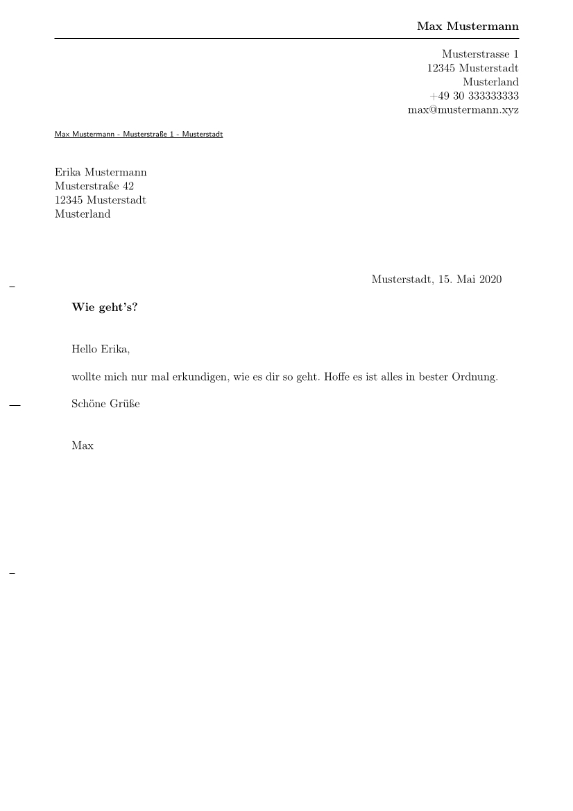

# write_letter

I don't really write a lot of letters. I mean letters that you actually print
out, put into an envelop, drop of at a post office, and that are delivered to
the recipient as a physical item. Mostly I use email or other means of digital
communication. But every once in a while, I have to write an acutal letter.
Usually those letters have an official character, and therefore I like them to
look official as well.

Earlier I used plain latex for that, but somehow having a full tex document for
each letter seemed too complicated. Since I had started to use pandoc and
markdown files (with or without yml headers), I tought it would be a good idea
to combine these tools and file type to get to a simpler solution. And maybe
someone is interested, therefore I thought, I share it here on github.

With this one command is enough to go from a file like this:

```
---
address:
    - Erika Mustermann
    - Musterstraße 42
    - 12345 Musterstadt
    - Musterland
opening:   Hello Erika,
closing:   Schöne Grüße
signature: Max
foldmarks: "true"
date:      \today
subject:   Wie geht's?
---

wollte mich nur mal erkundigen, wie es dir so geht. Hoffe es ist alles in
bester Ordnung.
```

to a pdf that looks like this:




## Requirements

I use this on a linux machine (right now Arch Linux, earlier Ubuntu). I don't
know if this works on any other system, but I guess it should.

Basically all you need are two things installed on your system:

- pandoc
- working latex distribution

I'm always a bit lazy when installing latex and I don't want to pick every
package manually, therefore I always install texlive-full (Ubtuntu) or
texlive-most (Arch). If you have a more minimal latex distribution, you might
have to install some latex packages. Some of the used packages in
**template_latex.tex** are probably not used everytime I write a letter, but
they are in there, because I needed some at some point.


## Usage

There are three files that make up the letter writing system:

- **template_latex.tex**: A template latex file, that is populated with sender
  information, recipient information, and the actual content of the letter by
  pandoc. Later it is translated into a pdf file.
- **template_sender.yml**: A yml file containing the information of the sender,
  which for me don't change ofter (only when I move).
- **template_letter.md**: A markdown file with the recipient information and the
  contents of the letter.

To translate the **template_letter.md** file into a nice looking pdf file, all
you need to run is:

```
pandoc --template=template_latex.tex -o letter.pdf template_letter.md
template_sender.yml
```

On my machine, I have put the **template_latex.tex** and the
**template_sender.yml** files in a template folder. When I write I latter, I
copy the the **template_letter.md** file into an appropriate folder, rename it
and adjust the content. I have a wrapper script called **write_letter**, that
calls pandoc with the appropriate arguments and is placed in a folder that is
part of may PATH.  This way I can just use the following command to generate
the pdf file:

```
write_letter [NAME_OF_MARKDOWN_LETTER_FILE].md
```

A template of the script file can be found in the file:
**template_write_letter**.
